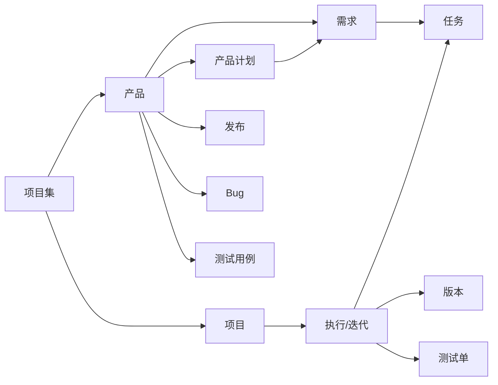

# 禅道与 zentao-cli 速览

本文档服务于 [SKILL.md](SKILL.md) 的 "第 1 步"，用于向用户快速介绍禅道与 zentao-cli，并完成工具就绪检查。

## 什么是禅道

禅道（ZenTao）是一款开源的一站式项目管理平台，覆盖研发团队的完整工作流：

- **需求管理**：记录、评审、变更业务需求与用户故事
- **项目管理**：组建项目、制定计划、排期执行
- **任务管理**：拆分任务、分派开发、跟踪进度
- **Bug 管理**：提交、指派、解决、回归 Bug
- **测试管理**：编写测试用例、执行测试单、记录缺陷
- **发布管理**：管理版本与发布，沉淀交付记录

核心对象之间的关系：



简单理解：**产品承载需求**，**项目承载执行（迭代）**，**执行承载任务**；Bug 和测试用例属于产品，测试单属于执行。

## 什么是 zentao-cli

[`@kerin/zentao-cli`](https://github.com/Kerinlin/zentao/tree/main/packages/zentao-cli) 是禅道命令行工具（本 monorepo 内 `packages/zentao-cli`），封装禅道 RESTful API v2.0，特点：

- 覆盖 20+ 模块（产品、项目、执行、需求、Bug、任务、测试用例、计划、版本、发布、反馈、工单等）的 CRUD 与状态流转
- 对 AI 友好：默认输出 Markdown 表格便于阅读，加 `--format=json` 可获取结构化数据
- 内置过滤、排序、分页、模糊搜索、字段摘取
- 工作区上下文：list / create 可省略 `--product` 等范围参数（≥1.3.1）
- `--product` 与 `--productID` 等价并双写；提 Bug 推荐 `upload` + `--steps-file`

更多命令细节见 [zentao-cli 技能文档](../zentao-cli/SKILL.md)。

## 两种接入方式

### 方式一：本地 CLI（推荐，快速上手）

优先使用系统中已有的包管理器全局安装：

```bash
npm install -g @kerin/zentao-cli
# 或 bun install -g @kerin/zentao-cli
# 或 pnpm install -g @kerin/zentao-cli
# 也可免安装：npx @kerin/zentao-cli
```

首次使用登录禅道：

```bash
zentao login -s https://zentao.example.com -u <账号> -p <密码>
```

登录成功后凭证缓存在 `~/.config/zentao/zentao.json`，后续无需重复登录。

也可以通过环境变量配置（优先级低于命令行参数）：`ZENTAO_URL`、`ZENTAO_ACCOUNT`、`ZENTAO_PASSWORD`、`ZENTAO_TOKEN`。

### 方式二：配置为 MCP 服务

若用户使用的智能工具（如 Cursor、Claude Desktop、Claude Code 等）支持 MCP，可把 zentao-cli 注册为 MCP 服务。**先 login，再 add-mcp**；配置里只写启动命令，不写密码：

```bash
zentao login
zentao add-mcp          # 交互选 Agent
# 或 zentao add-mcp claude-code / cursor / ...
```

手动配置示例：

```json
{
  "mcpServers": {
    "zentao-cli": {
      "command": "zentao",
      "args": ["mcp"]
    }
  }
}
```

- 鉴权：复用 `zentao login` 的本地 profile  
- 范围：当前 workspace  
- Claude Code 全局路径：`~/.claude.json` → `mcpServers`  
- 具体说明以 [包 README](https://github.com/Kerinlin/zentao/blob/main/packages/zentao-cli/README.md) 为准  

MCP 只提供精简 tool（Bug 工作流、账号/工作区、图片上传、产品/项目/版本/用户枚举），不是全量禅道 API。其它模块请用 CLI 技能。
## 就绪自检

正式开始前，顺手跑一下这两条，把账号和连通性确认掉：

```bash
zentao profile                               # 确认已登录，显示当前账号
zentao product --pick=id,name               # 能正常拉取产品列表
```

如果返回错误：

- `E1001` / `E1004`：未登录或 Token 失效 → 让用户执行 `zentao login ...`
- 命令找不到（`command not found`）→ 回到上文"方式一"安装
- 网络错误 / `E5001` → 检查禅道服务地址是否正确、网络是否可达

通了之后回到 SKILL.md，顺势问用户想从哪个角色切入就好。

## 外部资料

- [禅道官网](https://www.zentao.net/)
- [禅道使用手册](https://www.zentao.net/book/zentaopms/38.html)
- [禅道不同版本功能对比](https://www.zentao.net/compare-features.html)
- [zentao-cli 包](https://github.com/Kerinlin/zentao/tree/main/packages/zentao-cli)
